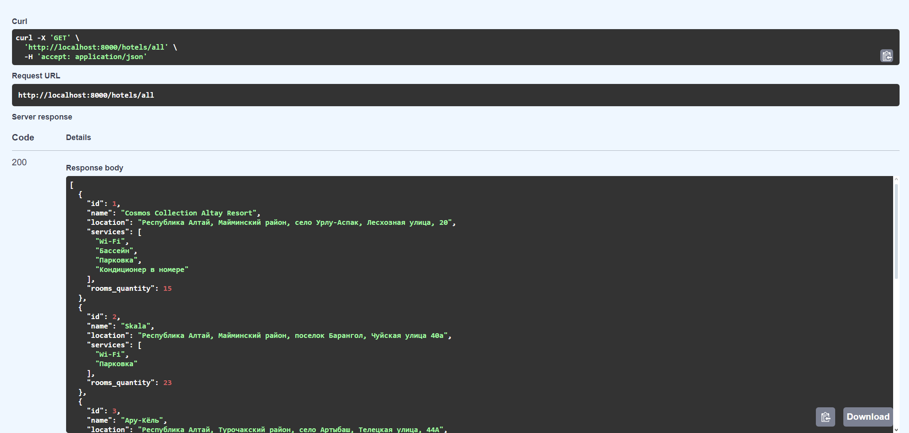

# Hotel bookings PET-project

### Как запустить Makefile на Windows?
- Скачать и установить [mingw-get-setup](https://sourceforge.net/projects/mingw/files/latest/download)
- Добавить в переменные среды ```PATH``` путь к ```mingw-get.exe```
- Установить mingw32-make в powershell через ```mingw-get install mingw32-make```
- Создать Makefile со следующей коммандой 
```
test_hello:
    @echo "Hello, Makefile!"
```
- Запустить Makefile 
```
$ mingw32-make test_hello
```
- Чтобы использовать шорткат "make", скопировать исходный файл под названием "make"
```
$ cp mingw32-make make
```
- Теперь шорткат "make" доступ на всей системе
```
$ make <CommandInMakeFile>
```

## Запуск приложения
- Получить копию репозитория
```
https://github.com/qustoo/FastAPIHotelsEducation
```
- Заполнить файл .env-non-dev переменными окружения
```
MODE=DEV
LOG_LEVEL = INFO

DB_USER = "user"
DB_PASS = "password"
DB_HOST = "host"
DB_PORT = 1234
DB_NAME = "database_name"
...
```
---
- Создайте виртуальное окружение, перейдите в него, и установите зависимости
```
make create_env
make install_depends
```
- Выполните миграции БД
```
make migrate
```
- Форматеры,линтеры и сортировка импортов: 
```
make black flake8 isort
```
- Запуск локально
```
make run
```
- Запуск через докер из коробки(Redis,Celery,Flower,PostgreSQL...)
```
make up
```
- Остановка контейнера
```
make down
```

## Celery & Flower
- Для запуска Celery используется команда  
```
celery --app=app.tasks.celery:celery worker -l INFO -P solo
```
- Параметр `-P solo` используется только на Windows
```
celery --app=app.tasks.celery:celery flower
``` 
## Sentry
- Зарегистрируйтесь на [сайте](https://sentry.io/welcome/). Выберите фреймфорк своего проеккта, скопируйте sentry_dns,  который вам предложат и введите его в .env-non-dev файл.


## Grafana / Prometheus
[Туториал по настройке графаны](https://grafana.com//tutorials/grafana-fundamentals/)

1. Для входа в кабинет нужно указать ```username: admin, password: admin```
2. Потом переопределить пароль
3. Чтобы заработали графики вы должны в grafana-dashboard указать свой uid в следующем куске кода:
```"datasource":{"type": "prometheus","uid": "ВАШ UID"} ```
4. Взять его можно из json-схемы предустановленных дашбордов  
   (в настройках add data source -> prometheus -> "выбираем имя").
Затем в Dashboards -> import -> Вставляем содержимое grafana-dashboard.json и выбираем какой-нибудь случайный uuid(и имя для дашборда)
5. Если не интересуют метрики / логирование можно отключить закоментировав строчки с sentry и instumentator в файле app/main.py и docker-compose

## Documentation
- Swagger IU <http://localhost:8000/docs>


## Screenshots
- All hotels in Swagger

- Login page

- Bookings

- All hotels at frontend


